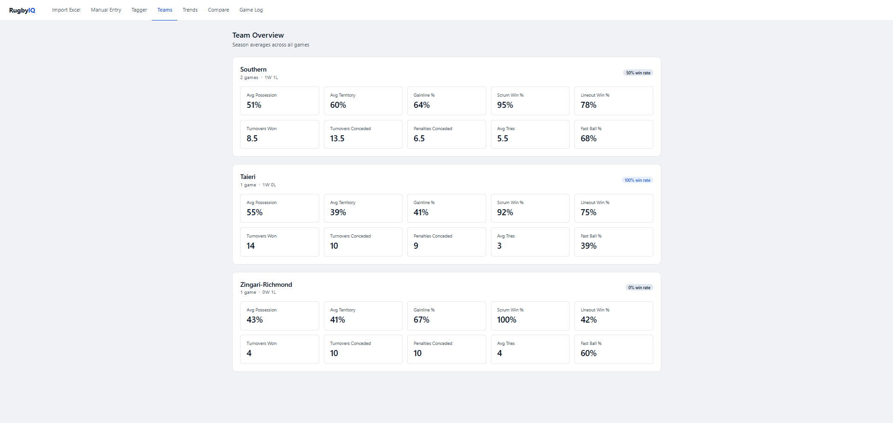
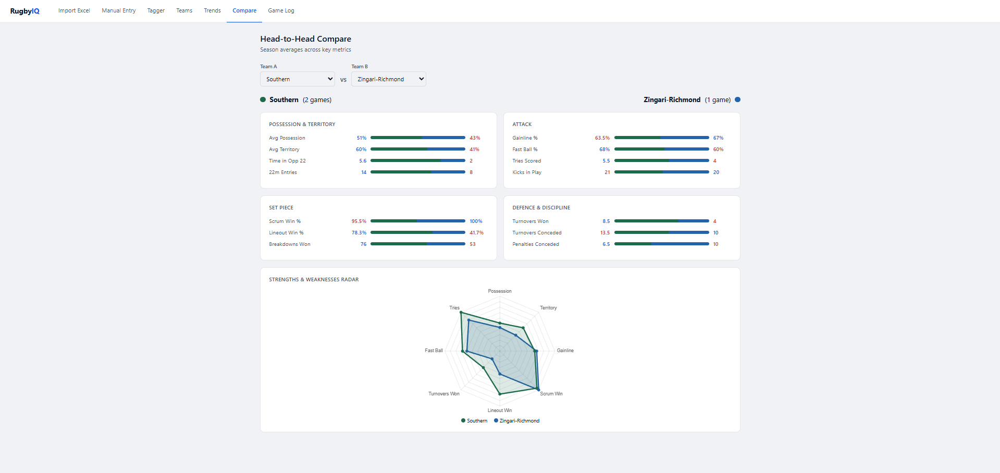
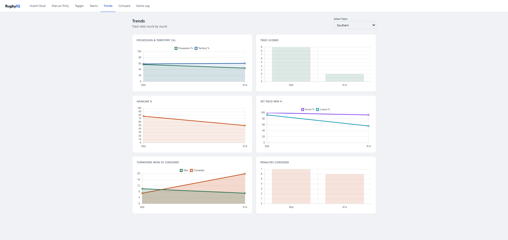
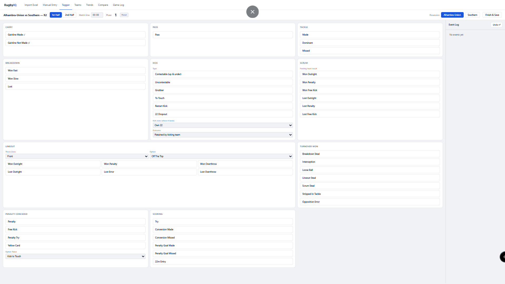
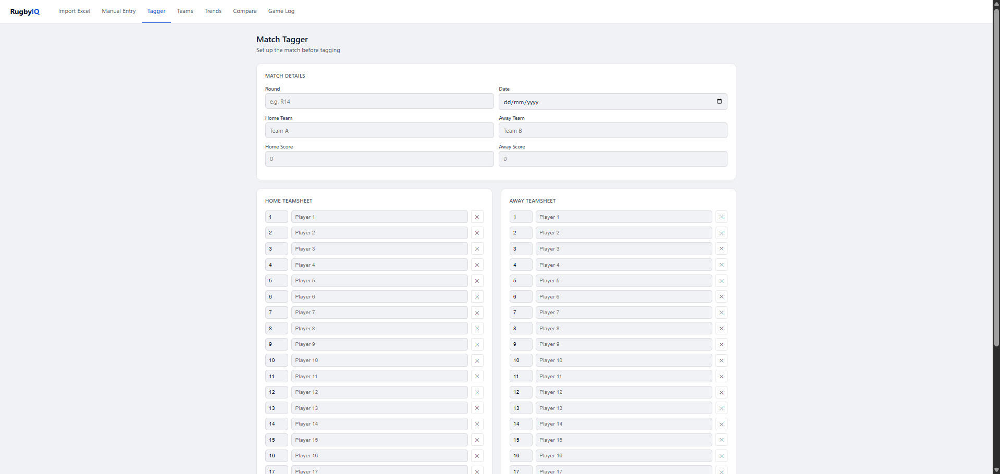
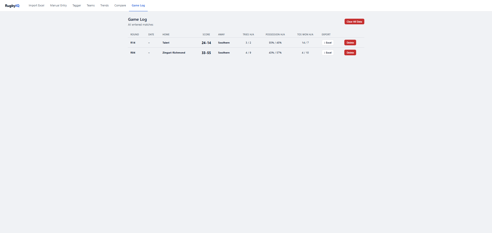

# RugbyIQ — Rugby Analytics Platform

A full-stack web application for tracking and analysing rugby match statistics.

## Features
- Import match data automatically from Excel report files
- Manual data entry for any match
- Season-long trend analysis with interactive charts
- Head-to-head team comparison with radar charts
- Live data persistence via REST API and SQLite database

## Tech Stack
- **Backend:** Node.js, Express
- **Database:** SQLite via better-sqlite3
- **Frontend:** Vanilla JavaScript, Chart.js
- **Data Import:** SheetJS (Excel parsing)

## Running Locally
1. Clone the repository
2. Install dependencies
```bash
    npm install
```
3. Start the server
```bash
    npm run dev
```
4. Open http://localhost:3000

## Screenshots

### Team Overview


### Head-to-Head Comparison


### Trends


### Match Tagger



### Game Log

